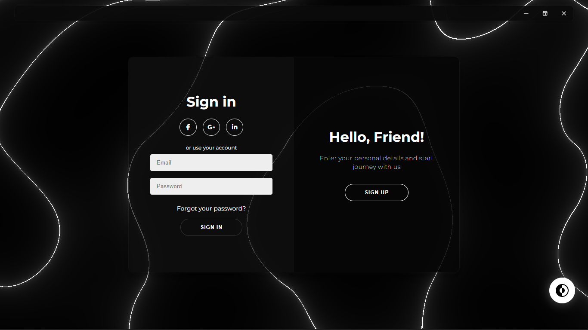
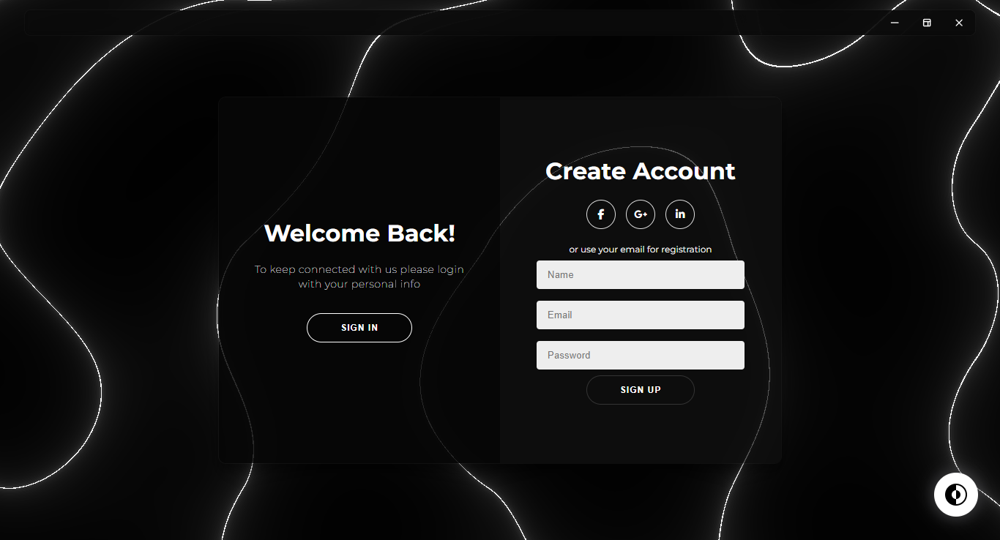

## [Electon JS](https://www.electronjs.org/docs/latest/) based Login SignIn.

## :seedling: Getting Started

- To run this code use `https://github.com/ManishTirkey/signIn-login-Electron-App.git` to clone.
- Run command `cd signIn-login-Electron-App`.
- Installing packages required using the command `npm i`.
- Run `npm start` this will run the program.
- Run `npm run build` this will build the exe file , setup path = ./dist/.

## :motorcycle: Other Repositories

- [Face-Recognition-for-Attendance `CustomTkinter`](https://github.com/ManishTirkey/Face-Recognition-for-Attendance.git)
- [Youtube Video Download App](https://github.com/ManishTirkey/Download_youtube_Videos)
  - Both Audio and video separately.
- [Control Volume with hand Gesture](https://github.com/ManishTirkey/Volume_control_opencv)
- [Screenshot Application](https://github.com/ManishTirkey/ScreenShot)
  - ElectonJS and python based Screenshot Application.
  - window sticks on top of window application.
  - Take screenshots of the particular area.
